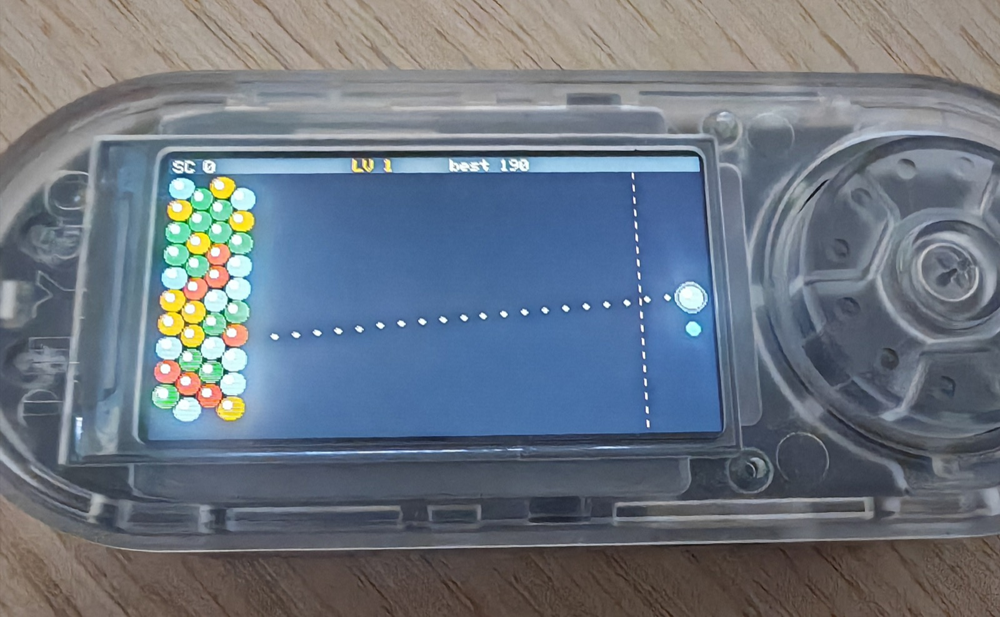
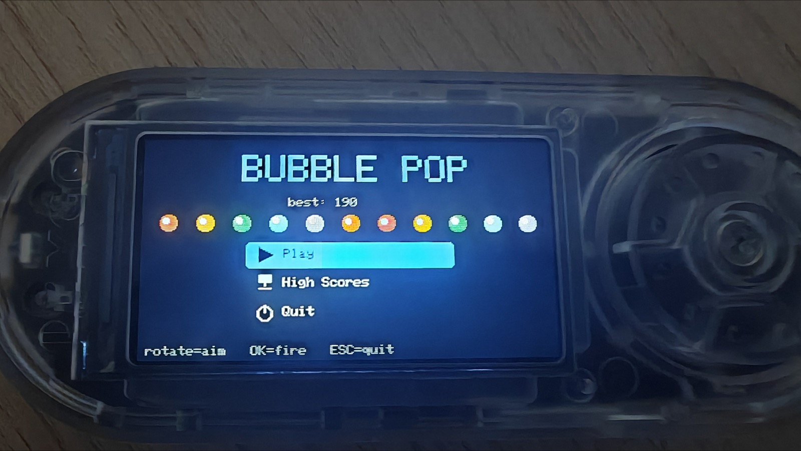

# 🫧 Bubble Pop — Bruce / LilyGO T-Embed CC1101

  [-F7DF1E)](https://github.com/BruceDevices/firmware) 

> **EN** — A **Puzzle-Bobble / bust-a-move** for the Bruce JS interpreter, built around the rotary encoder. Laid out **sideways** to fit the landscape screen: the bubble wall is anchored on the **left**, the shooter sits on the **right**. Match 3+ same-colour bubbles to pop them, cut loose whole clusters, and hold back the creeping wall.

> **FR** — Un **Puzzle-Bobble / casse-bulles** pour l'interpréteur JS de Bruce, pensé pour la molette. Disposé **en paysage** pour l'écran : le mur de bulles est ancré à **gauche**, le canon est à **droite**. Aligne 3+ bulles de même couleur pour les faire éclater, détache des grappes entières, et repousse le mur qui avance.

## 🎮 Controls / Contrôles

**Rotate = aim up/down**, **click = fire the bubble**, **ESC = menu**. The dotted guide shows the shot bouncing off the top/bottom walls.

**Molette = viser (haut/bas)**, **clic = tirer la bulle**, **ESC = menu**. Le pointillé montre le tir qui rebondit sur les bords haut/bas.

## ✨ Features / Fonctions

- 🫧 **Hex bubble grid** — a real hexagonal wall. Shots snap into place; **match 3+** of a colour and they pop.
- ⛓️ **Cluster physics** — pop a chain and any bubbles no longer connected to the wall **fall off** for bonus points.
- ⏩ **Creeping wall** — every few shots a fresh column is pushed in from the left. Let it cross the red **danger line** on the right and it's game over.
- 🆙 **Levels** — more colours (4 → 6), a faster-advancing wall and a thicker starting wall each level. "LEVEL n" flash.
- 🎯 **Next-bubble preview** at the shooter, colours always drawn from what's still on the field (so it stays solvable).
- 🏆 **Persistent top-5 high scores** (`/bubblepop_scores.json`) with **3-initials** entry on a record.
- 🖥️ Flicker-free rendering, picto menu decorated with a bubble row.

| Menu |
|---|
|  |

## 🚀 Install

1. Copy **`Bubble Pop.js`** onto the SD card (e.g. `/scripts` or `/BruceJS`).
2. On the device: **JS Interpreter → select `Bubble Pop.js`** (or add it to your favorites with [bruce-launcher](https://github.com/koua29/bruce-launcher)).
3. High scores are stored in `/bubblepop_scores.json` on the SD.

## 🛒 Matériel / Hardware

Le matériel utilisé pour ce projet — liens affiliés Amazon :

|  |  |  |
|:---:|:---:|:---:|
| 🔌 **[LilyGO T-Embed CC1101](https://link.amazon/B0cgD7wou)** avec antennes | ⬛ **[LilyGO T-Embed CC1101](https://link.amazon/B071fmsbH)** noir, sans antenne | 📡 **[Kit d'antennes SMA](https://link.amazon/B0eMlSqeZ)** |

En tant que Partenaire Amazon, je réalise un bénéfice sur les achats remplissant les conditions requises. · As an Amazon Associate I earn from qualifying purchases.

## 🙏 Credits & License

- Script: **koua29**. Runs on the excellent **[Bruce firmware](https://github.com/BruceDevices/firmware)**.
- Released under the **MIT License** — see [LICENSE](LICENSE).

## ☕ Coffee?

